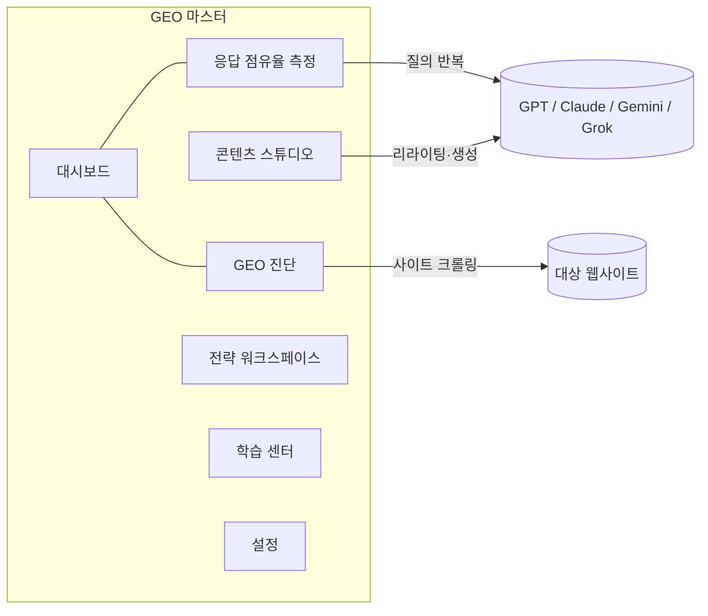

# GEO 마스터 앱 구축 계획

> 작성일: 2026-09-01
> 근거 자료: 「AEO·GEO 생존전략」(이자흥, 미래의창, 216쪽) · 「제로클릭 시대, GEO 대책」(박상현, 작가와, 78쪽) · 오픈바이브 SEO·GEO 커뮤니티 자료 정리(HTML)

---

## 1. 자료 분석 요약

### 1-1. 「AEO·GEO 생존전략」 — 이론·전략서

- **진실의 권력 이동**: 종교 → 언론 → 검색 알고리즘 → AI. AI가 "합의된 진실"을 결정하는 시대.
- **제로클릭 현상**: 구글 검색의 약 58.5%가 클릭 없이 종료. AI 요약 답변이 보편화될수록 가속(특정 카테고리 70%+).
- **AEO / GEO 정의**:
  - AEO(Answer Engine Optimization): AI가 질문에 직접 답할 때 특정 브랜드·정보가 인용되도록 최적화
  - GEO(Generative Engine Optimization): 생성형 AI가 정보를 전달할 때 우리 메시지가 선택되도록 최적화(더 넓은 개념, 책에서는 GEO로 통칭)
- **키워드 → 엔티티 전환**: AI는 단어가 아닌 실체(Entity)와 의미적 거리로 세상을 이해. 3차원 개념 공간에서의 의미 연결 게임.
- **응답 점유율(Answer Share)** = AI 시대의 시장 점유율:
  - 측정법: 브랜드명을 넣지 않은 핵심 질문 5개 선정 → ChatGPT/Claude/Gemini 등 각 AI에 반복 질의(예: 5질문 × 3모델 = 15회) → 스프레드시트에 언급 여부·순위·맥락 기록 → 점유율 계산
  - 젠랭크(GenRank): AI 답변 내 브랜드 언급 빈도·맥락·순위를 지수화(로그 할인, 모델별 시장 가중치 예: GPT 40%, Gemini 25%)
- **팁 메모리 vs 워킹 메모리**: 학습 데이터에 각인된 장기 기억(신념) vs 실시간 검색(RAG) 참조. 내부(모델 튜닝)는 바꿀 수 없으니 **외부(열린 웹 데이터)를 장악**하라.
- **GEO 프레임워크 1.0 — 7가지 도구**:
  1. 엔티티 매핑 — 스키마 마크업(JSON-LD), 엔티티 정의 템플릿
  2. 소스 다각화 — 공식/언론/학술/커뮤니티 4중창(토스 사례)
  3. 권위 밀도 — 권위 엔티티 옆에 서기(쿠팡="한국의 아마존")
  4. 의미적 연결 — 고객의 고통 → 업계 표준/인증 → 우리 브랜드 파이프라인
  5. 응답 조건화 — 트리거 워드("업계 표준", "1위") 학습시키기
  6. 다국어 맥락 확장 — 영어권 데이터에 엔티티 심기(AI의 모국어는 영어)
  7. AI 검증 루프 — 정기 질의로 오해 발견 → 데이터 수정 → 재학습 대기
- **GEO 퍼널 4단계**: 존재(Existence) → 맥락(Context) → 시의성(Recency) → 추천(Recommendation). 순차적이며 건너뛸 수 없음.
- **3단계 로드맵**: 1주차 존재 확인(AI에 브랜드 질문, 현황 기록) → 2~4주차 기초 정비(정의 통일, 열린 웹 배포) → 5~8주차 심화 최적화(스키마, 권위 매체, 도구 활용)
- **케이스 스터디**: 김캐디(구조화 데이터 공개로 LIV 골프 파트너십), 아이디어스(두쏜쿠 특수), 두들린/그리팅(문제 해결 맥락 장악), 모두싸인(1등도 GEO), 뷰릿(고민 키워드 연결), 마이리얼트립(여정 시작점 장악), 마이페어(고LTV 시장), 노션(PLG+UGC), 허브스팟(20년 콘텐츠 축적), 테슬라(=혁신 공식)
- **실패 조건**: ① 기본기 없는 최적화(제품·트래픽 부재) ② 실시간 반영 오해(학습 지연 2~3개월) ③ 채널별 브랜드 정의 불일치
- **GEO SaaS 지형**: 네이티브(Profound, Bluefish, Scrunch AI, Evertune, Peec AI, Goodie AI, Otterly, Gauge 등) vs 레거시 피벗(Ahrefs, Semrush, SE Ranking, BrightEdge, Surfer SEO 등), 한국(젠랭크 기반 측정, 의료 특화 등). 시장: 2024년 8.86억 달러 → 2031년 73.18억 달러 전망(CAGR 34%).
- **미래**: AI 에이전트 시대(사람 대신 AI가 검색·비교·결제), 멀티모달 GEO(이미지 메타데이터·영상 자막·챕터 마커), 실시간 학습(신선도가 랭킹 요소), 개인화(페르소나별 답변), 퍼널 제로, 국가 GEO(독도/동해 표기, 공공데이터 AI 친화성), 응답 점유율이 투자 심사 지표로.

### 1-2. 「제로클릭 시대, GEO 대책」 — 실행 매뉴얼

- **AI의 콘텐츠 평가 3기준**: 관련성(Relevance) · 신뢰성(Credibility) · 구조성(Structure)
- **검색 의도 4유형**: 정보 탐색형 / 비교·평가형 / 구매 결정형 / 문제 해결형 — 콘텐츠 기획 시 유형부터 결정
- **구매 여정 단계별 콘텐츠 설계**: 탐색(개념·비유) → 비교(비교표·균형 서술) → 구매 결정(수치 데이터·반론 FAQ)
- **도입부 3단 공식**: 문제 제시 → 핵심 답변 → 이 글의 가치
- **AI가 읽기 좋은 구조**: H1~H3 질문형 제목("어떤 상황의 누가, 무엇을 알 수 있는가"), 리스트·표·비교 카드, FAQ(3개 이상, 실제 고객 언어), 스키마 마크업(Article, FAQPage, HowTo, Product, LocalBusiness — FAQPage부터 권장)
- **신뢰도(E-E-A-T)**: 주장 대신 수치·출처·조건("자사 고객 100개사 기준, 전환율 30% 향상"), 최신성(6개월~1년 주기 업데이트, 날짜 명시)
- **멀티모달**: 이미지 alt에 '정보' 담기(차트 수치까지), 파일명 영문 서술형, 영상 자막·챕터 마커·설명 첫 2~3줄 요약, 인포그래픽 텍스트 버전 병행
- **질문 데이터 5가지 소스**: 고객 상담 채널 / 챗봇 로그 / SNS·커뮤니티 / 서치콘솔 / AI에게 직접 질문
- **질문 매핑**: 의도 유형 × 고객 세그먼트 × 구매 단계 분류 워크시트(20~30개 질문 목표)
- **다면적 콘텐츠 생태계**: Pillar(3,000~5,000자 종합 가이드) – Cluster(800~1,500자 세부 주제) – Supporting(비교표·체크리스트·계산기) 토픽 클러스터 + 월별 콘텐츠 캘린더(기반 구축 → 세그먼트 확장 → 문제 해결 강화 → 지원 자료 → 업데이트 → 공백 보완)
- **리라이팅 5패턴**: ① 형용사→수치 ② 일반→조건부 ③ 나열→구조화(리스트화) ④ 두루뭉술→특정 대상 명시 ⑤ 결론 후치→결론 선행
- **재정비 우선순위 2×2**: 현재 유입(높/낮) × AI 인용 가능성(높/낮) — "유입 높음+인용 가능성 높음"부터 GEO 레이어 추가
- **4주 모니터링 사이클**: 1주차 모니터링(질문 세트 20~30개 입력·기록) → 2주차 분석(전월 비교) → 3주차 우선순위(개선 대상 3~5개) → 4주차 콘텐츠 개선(리라이팅·재발행)
- **성과 지표 재설계**: 순위·클릭률 → AI 답변 내 브랜드 언급 횟수, 인용 후 직접 유입, 브랜드 검색량 변화, 인용 문맥 일치도, 출처 언급 빈도
- **GEO+SEO 통합 실행 체크리스트 32항목**: ① 기반 SEO 7 ② GEO 콘텐츠 구조 7 ③ 신뢰도·E-E-A-T 6 ④ 기술적 GEO(스키마·멀티모달) 6 ⑤ 브랜드 노출 전략 6 — 25개 이상 체크 시 우수, 20개 미만이면 우선 개선
- **부록**: GEO 실행 체크리스트 38항목, 추천 AI 도구 가이드, SEO→GEO 용어 대조표(키워드→검색 의도, CTR→인용 빈도, 백링크→신뢰 언급, 도메인 점수→E-E-A-T 점수, 트래픽→브랜드 발견 등)
- **마케터 사고방식 전환 7가지**: 노출→발견, 키워드→맥락, 클릭→인용, 양→생태계 깊이, 경쟁→신뢰, 마케팅≠콘텐츠→콘텐츠=브랜드 자산, 즉시 효과→누적 효과

### 1-3. 오픈바이브 커뮤니티 자료(HTML)

- 방 결론: **SEO → AEO → GEO** 순서. GEO는 SEO가 된 뒤에 올린다. "구글이 GEO는 필요 없다고 했다"는 낭설(팩트체크 링크 있음).
- 참고 오픈소스: `AgriciDaniel/claude-seo`(서브스킬 25개), `every-app/open-seo`(Semrush 대안), `zubair-trabzada/geo-seo-claude`(인용 가능성 점수·AI 크롤러 분석), `yaojingang/yao-geo-skills`, `joeseesun/qiaomu-seo`, `leopard627/fire-your-seo-agency`(SEO·AEO·GEO·네이버 NEO), `AgriciDaniel/seo-os`
- 유사 도구: GEO Score(geo-score.netlify.app, 체크리스트형), Semrush, Firecrawl(수집 레이어)

---

## 2. 앱 목표

분석한 자료의 방법론을 **그대로 실행할 수 있는 올인원 GEO 워크스페이스**를 만든다. 책의 핵심 프레임워크(GEO 퍼널 4단계, 응답 점유율, 7가지 도구, 32/38항목 체크리스트, 리라이팅 5패턴, 질문 매핑)를 각 모듈로 구현한다.

## 3. 기술 스택

| 영역 | 선택 | 이유 |
|---|---|---|
| 프레임워크 | Next.js(App Router) + TypeScript | 서버 라우트로 LLM 호출·사이트 크롤링 처리(CORS 회피), 커뮤니티 자료에서도 SEO 친화 스택으로 언급 |
| 스타일 | Tailwind CSS | 빠른 UI 구축, 다크 톤 대시보드 |
| 데이터 | SQLite(better-sqlite3) + Drizzle ORM | 로컬 파일 DB로 프로젝트·측정 이력·체크리스트 저장 |
| LLM | openai / @anthropic-ai/sdk / @google/genai / NAVER Cloud REST | 4사 통합 인터페이스, API 키는 설정 화면에서 입력 |
| 파싱/차트 | cheerio(진단 크롤러), recharts(추이 차트) | |

## 4. 모듈 구성

### 4-1. 대시보드 `/`
- GEO 퍼널 4단계(존재→맥락→시의성→추천) 현재 단계 표시 — 측정 결과로 자동 판정
- 응답 점유율 추이 차트(모델별·월별), 최근 진단 점수, 체크리스트 진행률, 4주 사이클 현황

### 4-2. GEO 진단 `/audit`
- URL 입력 → 서버에서 HTML/robots.txt/llms.txt/sitemap 수집 후 자동 점검:
  - 기반 SEO: title/meta/H1~H3 구조, canonical, OG 태그, 내부링크, 이미지 alt
  - GEO 구조: 질문형 소제목, 리스트/표 존재, FAQ 섹션, 발행·수정일 표기
  - 기술적 GEO: JSON-LD 스키마(Organization/FAQPage/Article 등) 검출, AI 크롤러 차단 여부(GPTBot·ClaudeBot·PerplexityBot·Google-Extended)
- 자동 점검 + 수동 체크 항목을 합쳐 **32항목 통합 체크리스트** 점수화(책 기준: 25+ 우수 / 20 미만 개선 필요), 카테고리별 리포트와 개선 권고 출력, 이력 저장

### 4-3. 응답 점유율 측정 `/share`
- 프로젝트 설정: 브랜드명·경쟁사·카테고리·핵심 질문 세트(책의 측정법 기반 질문 템플릿 제공, 브랜드명 미포함 원칙)
- 실행: 선택한 모델들 × 질문 × 반복 횟수로 질의 → 응답에서 브랜드/경쟁사 언급 감지(문자열 매칭 + LLM 판정으로 맥락 긍/부정 분류)
- 결과: 응답 점유율 %(책의 공식), 경쟁사 비교, 모델별 차이, 회차별 이력 → 퍼널 단계 자동 판정
- 월 1회 측정 루틴(책의 4주 사이클 1주차) 기록 대체

### 4-4. 콘텐츠 스튜디오 `/studio`
- **리라이팅 5패턴**: 원문 붙여넣기 → 패턴(형용사→수치, 일반→조건부, 나열→구조화, 대상 명시, 결론 선행) 선택 → LLM 리라이팅, 전/후 비교
- **도입부 3단 공식** 생성기(문제 제시→핵심 답변→글의 가치)
- **FAQ 생성기** + FAQPage JSON-LD 코드 출력
- **엔티티 정의 템플릿**("[회사명]은 [타깃]을 위해 [수치/성과]의 [핵심 가치]를 제공하는 [카테고리] 서비스") + Organization JSON-LD 생성기

### 4-5. 전략 워크스페이스 `/strategy`
- **질문 매핑 워크시트**: 질문 수집(5가지 소스 태그) → 의도 4유형 × 고객 세그먼트 × 구매 단계 분류 표
- **토픽 클러스터 보드**: Pillar–Cluster–Supporting 구조 설계, 질문 매핑과 연결해 공백 맥락 표시
- **콘텐츠 캘린더**: 월별 계획(책의 연간 캘린더 프레임 기본값 제공)
- **4주 모니터링 사이클 보드**: 모니터링→분석→우선순위→개선 체크 루틴

### 4-6. 학습 센터 `/learn`
- 두 책 핵심 개념 요약(제로클릭, AEO/GEO, 엔티티, 팁·워킹 메모리, 7가지 도구, 6가지 법칙, 패러다임 시프트 7)
- SEO→GEO 용어 대조표, 케이스 스터디(김캐디·모두싸인·노션·허브스팟 등), **부록 38항목 실행 체크리스트**(체크 상태 저장)

### 4-7. 설정 `/settings`
- API 키 관리(OpenAI/Anthropic/Gemini/Grok), 브랜드 프로필, 모델·반복 횟수 기본값

### 4-8. 예약 측정 자동화 `/automation`
- 질문·provider·반복 수·다음 실행·주기를 저장하고 활성/정지·수정·삭제·즉시 실행 제공
- SQLite 영속 작업 큐, due slot UNIQUE 멱등키와 조건부 `UPDATE … RETURNING` 원자 claim
- 월·건별 비용 한도, provider별 호출 추정 단가, 대기 중 상한 예약과 종료 후 호출 시도 기반 정산
- stale lease 자동 재실행 금지, 협조적 취소, 사용자 명시 재시도와 오류 코드·접근 가능한 경고 표시

### 4-9. 전용 리포트 `/reports`
- 완료된 진단·응답 점유율 이력의 근거 미리보기와 JSON·UTF-8 BOM CSV·서버 PDF 다운로드
- dependency 없는 PDF 1.7 object/xref writer, A4 자동 페이지 나눔과 진단·점유율 전용 보고서 템플릿
- 한국어 Type0 CID font(`HYSMyeongJo-Medium`, `UniKS-UTF16-H`)와 UTF-16BE hex text로 PDF 연산자 주입 차단
- 200페이지·12MB·측정 근거 1,000건 상한, 생략 고지, `no-store`·`nosniff` attachment; 브라우저 인쇄는 보조 경로

## 5. DB 주요 테이블

`settings`(API 키), `projects`(브랜드·경쟁사), `questions`/`question_sets`, `measure_runs`/`measure_results`(언급·맥락), `measurement_schedules`/`measurement_jobs`/`automation_policy`(예약·큐·비용), `audits`/`audit_items`, `contents`(스튜디오 결과), `checklist_states`, `strategy_items`(매핑·클러스터·캘린더)

## 6. 구현 순서

1. 잔여 OCR 백그라운드 작업 정리(`_ocr/` 삭제) → Next.js 프로젝트 스캐폴드(레이아웃·네비게이션·다크 톤 UI)
2. DB 스키마 + 설정 화면 + LLM 클라이언트 공통 모듈(4사 통합 인터페이스)
3. GEO 진단 모듈(크롤러 + 체크리스트 엔진 + 리포트)
4. 응답 점유율 측정 모듈(실행 파이프라인 + 결과 분석 + 이력)
5. 대시보드(퍼널 판정 + 차트)
6. 콘텐츠 스튜디오(4개 도구)
7. 전략 워크스페이스(워크시트·클러스터·캘린더·사이클)
8. 학습 센터(책 내용 정리 콘텐츠)
9. README 작성, 빌드·린트 검증, 브라우저 스모크 테스트

## 7. 참고 사항

- 책의 실측정 주의사항 반영: 시크릿 모드 대응은 API 호출로 대체되므로 해당 없음. 반복 횟수 기본 3회/질문, 모델 가중치(예: GPT 40%, Gemini 25%)는 설정 가능 옵션으로 제공
- API 키는 로컬 SQLite에 저장하고 서버 라우트에서만 사용(클라이언트 노출 금지), `.gitignore`에 DB 파일 포함
- 후속 확장 아이디어였던 llms.txt 생성기, 전용 서버 PDF 리포트, 멀티모달 감사, xAI Grok, 비밀 없는 팀 공유 스냅샷, 예약 측정·영속 큐·비용 한도도 구현 완료

---

## 8. 구현 완료 현황 (2026-09-01)

### 8-1. 핵심 계획 완료

- [x] OCR 산출물 정리 — 294장을 영구 삭제하지 않고 macOS 휴지통으로 이동
- [x] Next.js App Router·Tailwind 다크 UI와 12개 반응형 라우트
- [x] SQLite/better-sqlite3 + Drizzle 14개 테이블, 콜드스타트 부트스트랩과 비파괴 스키마 마이그레이션
- [x] AES-256-GCM API 키 저장, 브랜드·4개 모델·가중치·반복 수 설정
- [x] OpenAI·Anthropic·Gemini·xAI Grok 공통 LLM 인터페이스
- [x] SSRF/DNS rebinding 방어형 사이트 수집과 32항목 GEO 진단
- [x] 반복 응답 점유율·문맥·경쟁사·GenRank·퍼널 측정 및 이력
- [x] SQLite 영속 예약·원자 작업 큐·비용 한도와 호출 시도 정산
- [x] 진단·점유율 전용 서버 PDF 1.7 renderer, 한국어 템플릿과 다운로드 UI
- [x] Recharts 대시보드와 원자료 가중 월간 추이
- [x] 콘텐츠 스튜디오 4도구와 FAQPage/Organization JSON-LD
- [x] 질문 매핑·토픽 클러스터·캘린더·4주 사이클 CRUD
- [x] 학습 콘텐츠와 영속 가능한 38항목 체크리스트
- [x] README, 단위·통합 테스트, 빌드·린트·타입·브라우저 검증

### 8-2. 검증 결과

- Vitest: 20개 파일, 103개 테스트 통과
- 커버리지: statements 79.97%, branches 69.12%, functions 85.97%, lines 82.40%
- TypeScript 및 ESLint(경고 0), Next.js 프로덕션 빌드 통과
- 프로덕션 API: 대시보드, 공개 URL 32항목 진단·멀티모달 감사, JSON/CSV/PDF·스냅샷 attachment, 자동화 비용·큐 상태 전이 확인
- 보안: 검증 IP 소켓 고정, 리다이렉트 재검증, localhost 바인딩, cross-site 403, non-JSON 415, 비밀 없는 스냅샷·예약 payload 확인
- 브라우저: 12개 라우트, 전용 PDF 링크·빈 이력 disabled 상태·리포트 print CSS, 멀티모달 부분 실패, 4개 LLM UI, 스냅샷 merge/replace·키 보존, 자동화 예약 수정·비용 정산, 375px 화면 확인
- PDF 파일: 실제 API의 PDF 1.7/xref/UniKS CMap·attachment 보안 헤더, macOS `file` 인식과 Quartz 한국어 렌더링 확인
- 독립 적대적 보안·품질 검토, PDF parser injection·상한·Unicode·실패 응답과 자동화 비용·stale/slot 경합 수정 후 별도 fix verifier 완료

### 8-3. 후속 확장 완료

핵심 구축 범위와 합의된 후속 확장까지 모두 완료했다.

1. [x] llms.txt 생성·미리보기·다운로드와 재진단 워크플로 — `/llms`
2. [x] 진단/응답 점유율 JSON·UTF-8 CSV와 전용 서버 PDF 1.7 리포트 — `/reports`
3. [x] 이미지 alt·파일명·차트 텍스트·영상 자막/챕터/대본 멀티모달 일괄 감사 — `/multimodal`
4. [x] xAI Grok 공식 Responses API 제공자 어댑터, 설정·측정·스튜디오·대시보드 통합
5. [x] 비밀 없는 schema v1 팀 공유 스냅샷, ID 재매핑 병합·확인형 교체·트랜잭션 롤백 — `/workspace`
6. [x] 예약 측정·SQLite 영속 작업 큐·월/건별 비용 한도·취소/재시도 — `/automation`

필수 잔여 항목은 없다. 사용자 인증·권한 기반 실시간 협업과 원격 동기화만 별도 선택 범위다.

구현 상세와 후속 작업 주의사항은 `docs/IMPLEMENTATION_HANDOFF.md`에 기록한다.
