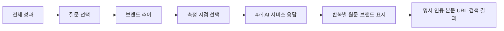

# AI 언급 모니터링 2차 적용 계획

작성: 2026-10-08 · 기준: 사용자가 추가한 레퍼런스 이미지 15장 및 현재 작업 트리

## 1. 적용 방향

목표는 **어떤 질문에서 → 언제 → 어떤 AI가 → 어떤 원문과 출처로 우리 브랜드를 언급했는지** 한 화면에서 확인하는 것이다. 이미 구현한 전체·질문별 집계를 유지하고, 측정 시점 선택과 모델별 응답 근거를 연결한다.

이 문서는 작성 당시의 구현 명세와 예시 데이터 기반 인터랙션 시안이다. 이후 A~D를 실제 앱에 구현했으며, 구현·QA 결과는 `output/monitoring-v2/2026-10-08/구현QA결과.md`에 기록한다. 아래의 현재/다음 변경 표는 계획 작성 시점 기준이다. E는 별도 과제로 유지하며 배포는 이 작업에 포함되지 않는다.

### 유지할 결정

- ChatGPT / Claude / Gemini / Grok 4개 서비스만 유지한다. Perplexity를 추가하지 않는다.
- 일반 응답과 웹검색 응답은 **같은 서비스의 측정 조건**이다. 별도 LLM 개수로 세지 않는다.
- 현재 저장된 응답을 읽어 보여준다. 화면 조회·그래프 선택 시 외부 LLM 호출은 없다.
- 언급률은 성공 응답 중 브랜드 언급 비율이다. 실패·거절·미측정은 0%와 구분한다.
- 질문 원문과 측정 이력을 보존한다. 질문 편집 후 이전 이력을 새 문장에 합치지 않는다.
- 현재 프로젝트의 테마·레이아웃을 유지한다. 레퍼런스의 검정 배경, 영상 자막, 화살표, 개인정보 가림 영역을 제품 UI로 복제하지 않는다.

## 2. 레퍼런스 이미지별 분석

| 이미지 | 관찰된 요소 | 프로젝트 적용 |
| --- | --- | --- |
| 1 | 15개 질문, 브랜드별 색상·언급 수치, 질문별 추이 | 질문 검색·정렬과 접을 수 있는 브랜드 요약을 추가. 자사 고정, 경쟁사 선택은 기존 기능 재사용 |
| 2·3 | 날짜별 AI 응답 카드, 웹검색 유무, 자사 언급·미언급, 응답 펼치기 | 이번 확장의 핵심. 그래프 시점 → 4개 서비스 카드 → 반복 응답 원문·출처 순으로 탐색 |
| 4·6 | 질문 바로 옆 기준→현재 수치 | 목록을 더 촘촘히 배치하되 질문 원문을 읽을 수 있도록 줄바꿈 유지. 변화 방향은 색과 부호를 함께 사용 |
| 5·10 | 자사 선·포인트를 굵게 강조 | 자사 굵은 선과 이중 링 포인트, 선택 실행의 세로 가이드. 경쟁사 색은 브랜드 ID 기준으로 고정 |
| 7 | 레이더와 모델별 증감 표 | 기존 4축 유지. 표가 정확한 수치의 기준이며 미측정을 0으로 채우지 않음 |
| 8·11 | 전체 추이 → 총 변화 → 모델별 비교의 수직 흐름 | 기존 전체 화면을 유지하고 응답 수·측정 조건 정보를 보강 |
| 9·12·13 | 프로젝트 요약, 질문 목록, 전체/상세 전환 | 기존 구조와 가장 가깝다. 새 화면을 분리하지 않고 `/monitoring` 안에서 확장 |
| 14·15 | 지역·서비스가 다른 질문의 성과 차이 | 검색·현재 언급률/변화순 정렬을 우선 추가. 지역·의도 태그와 질문 설계 도우미는 후속 단계 |

이미지의 `2 / 14 (25%)`는 단순 비율과 일치하지 않는다. `19.6%`, `8.4%`도 가중치인지 관측 비율인지 이미지로 확정할 수 없다. 이 산식은 도입하지 않는다. 가려진 기관명·질문 내용은 추정하거나 복원하지 않는다.

## 3. 현재 구현과 차이

| 기능 | 현재 코드 근거 | 상태 / 다음 변경 |
| --- | --- | --- |
| 전체·질문별 언급률, 주간 집계, 기준·현재 | `src/lib/monitoring.ts` | 구현됨. 집계 산식 유지 |
| 4개 모델 레이더·표 | `MonitoringCharts.tsx`, `monitoring-types.ts` | 구현됨. 4축 유지 |
| 질문 추가·수정·이력 보존 | `MonitoringQuestionEditor.tsx`, `question-pool.ts` | 구현됨. 편집창 취소·프로젝트 전환 보호 유지 |
| 브랜드 현황·선 선택 | `MonitoringClient.tsx` | 구현됨. 색상 ID 고정, 압축 요약 개선 |
| 그래프 시점 → 원문 | 차트는 현재 읽기 전용 | 실행 ID 선택 이벤트와 접근 가능한 실행 선택기 필요 |
| 원문·검색 조건·오류·모델 버전 | `measure_results`, `measure-runs.ts` | 저장돼 있음. 모니터링 전용 응답 조회 추가 |
| 인용·검색 결과·본문 URL | `measure_citations`, `grounding.ts` | 저장돼 있음. 응답 ID로 조회해 카드와 연결 |
| 정확한 질문별 응답 필터 | 기존 결과 API의 `q`는 질문/모델/원문 전체 부분검색 | 그대로 재사용하면 다른 질문이 섞일 수 있음. 질문 키→정확한 원문 비교 필요 |
| 질문 검색·정렬 | 현재는 질문 전체를 순서대로 표시 | 화면 목록 필터로 추가. 전체 성과 분모는 바꾸지 않음 |
| 미등록 브랜드 자동 발견 | 현재 등록 경쟁사 최대 20개 | 자동 추출은 없음. 이번 단계에 포함하지 않음 |
| 전·후 비교 조건 표시 | 현재는 기간의 첫/마지막 완료 실행 | 조건 차이를 알려주고, 이후 동일 조건 비교를 별도로 도입 |

## 4. 최종 사용자 흐름



### 전체 화면

1. 프로젝트 요약 / 조회 기간 / 완료 실행 수 / 내보내기.
2. 질문 목록: 검색, 정렬, 질문 추가.
3. 전체 성과: 주별 차트 → 기준·현재·증감 → 4축 레이더와 모델 표.
4. 현재처럼 해당 기간의 전체 등록·측정 질문을 집계한다. 질문 목록 검색으로 숨겨진 질문도 전체 집계에는 포함된다. 검색창 옆에 `목록만 검색` 표시.

### 질문 상세 화면

1. 질문 원문과 기준→현재 언급률.
2. 기존 브랜드 현황 표, 자사 고정 및 경쟁사 선택.
3. 브랜드 추이와 실행 선택기. 그래프 점 또는 날짜 선택으로 실행을 바꾼다.
4. **선택 실행의 AI 응답**: 같은 페이지 하단에 4개 서비스 카드.
5. 카드 펼치기 → 반복별 원문, 브랜드 표시, 출처.

상단의 기간 비교와 현재 실행 브랜드 표는 계속 기간의 마지막 실행 기준이다. 과거 점을 선택하면 응답 패널 및 별도의 `선택 시점 언급률`만 바뀐다. 두 기준을 같은 “현재”로 표현하지 않는다.

### 상태·URL

- `/monitoring?start=…&end=…&question=<sha256>&run=<id>`로 시점을 복원한다.
- `run` 생략 시 해당 질문이 측정된 가장 최근 실행을 선택한다. 기간 전체 마지막 실행에 해당 질문이 없으면 이를 명시한다.
- 실행 선택은 `replaceState`, 질문 전환은 `pushState`. 브라우저 뒤로 가기가 클릭한 모든 차트 점을 순회하지 않게 한다.
- 질문 전환 시 `run`을 제거하고 새 질문의 최근 실행으로 초기화한다.
- 기간 변경 후 기존 실행이 범위에서 벗어나면 “선택한 실행이 조회 기간 밖입니다”와 최근 실행으로 이동하는 버튼을 보여준다. URL에 지정된 잘못된 실행을 조용히 다른 실행으로 대체하지 않는다.
- CSV는 기존처럼 기간·질문 전체 추이를 내보낸다. 버튼을 `기간 CSV 내보내기`로 명확히 하고 선택 실행 원문 CSV는 후속 범위로 둔다.
- URL의 `run`은 상세 조회 전용 상태다. 기존 집계 API와 CSV에는 전달하지 않는다. 현재 쿼리 스키마가 알 수 없는 필드를 거절하므로 요청 파라미터를 명시적으로 분리한다.

## 5. AI 응답 카드 명세

4개 카드 순서는 ChatGPT, Claude, Gemini, Grok으로 고정한다. 서비스가 미측정이어도 카드 자리와 이름을 유지한다.

### 접힌 카드

- 서비스 이름, 실행 당시 모델명. 반환 모델명이 있으면 `실제 응답 모델`로 별도 표시.
- `자사 언급 2 / 성공 응답 3 · 66.7%`와 성공·실패·거절 수.
- 반복이 있으면 “일부 응답 언급”으로 표시한다. 단일 체크 아이콘만으로 전체 성공을 표현하지 않는다.
- 현재 설정으로 매칭한 자사·등록 경쟁사 이름을 요약한다.
- 원문이 없는 실행은 `원문 없음`. 미언급, 실패, 미측정과 구분한다.

패널 상단의 `언급 서비스 2 / 4`는 서비스 수이며 언급률이 아니다. `자사 언급 응답 5 / 성공 응답 12 = 41.7%`를 별도 표시한다. 이 둘을 한 수치로 합치지 않는다.

### 펼친 카드

- 실행·서비스 내부에서 `일반 응답` / `웹검색 요청` 조건 그룹을 표시한다. 실제 저장된 그룹만 제공하며 서비스 수는 계속 4개다.
- 반복 번호 선택, 상태, 원문, 자사·등록 경쟁사의 매칭 구간 표시.
- 원문은 저장된 텍스트 그대로 표시한다. 브랜드 판정은 현재 모니터링 사전으로 재계산하고 `현재 브랜드 설정 기준`을 표시한다.
- `matched_spans`, `brand_mentioned` 등의 과거 저장 판정을 현재 집계와 섞지 않는다. 필요하면 과거 판정은 별도 보조 정보로 표시한다.
- 원문은 기본 텍스트 렌더링, 줄바꿈 유지. LLM 응답의 HTML은 실행하지 않는다. 원문 복사 버튼 제공.

### 검색 상태

| 저장 값 | 표시 |
| --- | --- |
| `search_mode=off` | 일반 응답 |
| `search_mode=web`, `search_performed=true` | 웹검색 수행 확인 |
| `search_mode=web`, `search_performed=false` | 웹검색 요청 · 수행 미확인 |
| `search_mode=web`, `search_performed=null` | 검색 수행 여부 기록 없음 |
| 과거 데이터에서 근거 부족 | 검색 조건 확인 불가 |

현재 수집 코드는 Grok을 웹검색 지원 목록에 넣지 않으며, 일부 키 경로의 OpenAI도 일반 응답으로 전환한다. 이는 **현재 로컬 구현의 동작**이다. 공급자 API의 최신 지원 범위를 이 문서에서 판정하지 않는다. 실제 결과의 검색 수행 값을 보고 표시하고 “with Web Search” 카드를 임의로 생성하지 않는다. 조건 전환으로 기록된 `off`만으로 사용자가 검색을 요청하지 않았다고 단정하지 않는다. 실행 summary의 요청 조건과 함께 설명한다.

### 출처

- `cited`: 명시 인용.
- `inline`: 본문에 적힌 URL.
- `searched`: 검색 결과로 관측된 URL.
- 이 세 종류를 서로 구분하고, 도메인만 등장한 경우 브랜드 언급으로 세지 않는다.
- 네이버 지도·카카오맵 등은 출처 목록에 표시한다. 설정에서 경쟁사로 등록하지 않았다면 경쟁 브랜드 표에 자동으로 넣지 않는다.
- 링크는 검증된 HTTP(S)만 제공하며 새 창으로 열기임을 알린다. 서버가 원문에 담긴 URL을 자동으로 방문하지 않는다.
- 인용 출처의 카테고리는 저장 당시 분류임을 표시한다. 현재 브랜드 설정 기준 재집계와 혼동하지 않도록 한다.

## 6. 화면·디자인 명세

아래 수치는 스크린샷에서 측정한 원본값이 아니라 프로젝트에 적용할 제안값이다. 실제 JSX에서는 현재 Tailwind 크기와 기존 토큰을 사용한다.

| 영역 | 적용값 / 토큰 |
| --- | --- |
| 넓은 화면 | 기존 앱 셸 안 2열, 질문 `minmax(280px,0.42fr)`, 성과 `minmax(0,1fr)`, 간격 `gap-5` |
| 카드 | 기존 `Card`, `--app-card-bg`, `--app-card-border`, `--radius-xxl` |
| 텍스트 | `--app-text`, 보조 `--app-text-muted`; 질문 14px/24px, 섹션 제목 18px |
| 증가·감소 | `--app-status-good` / `--app-status-danger`, +/− 부호·증가/감소 이름 병기 |
| 전체 성과 곡선 | `--app-chart-current`; 실제 측정점 간 선형 연결, 미측정 연결 안 함 |
| 자사 상세 선 | `--app-text`, 3.5px; 일반 포인트 4px, 선택 링 8px |
| 경쟁사 | 현재 색상 토큰 팔레트를 ID로 안정적으로 배정. 색이 겹치면 점 모양·선 패턴 추가 |
| 비교 레이더 | 현재 `--app-chart-current`, 기준 `--app-chart-previous`, 4축·0~100 고정 |
| 수치 | tabular-nums, 소수점 1자리, 증감 %p |
| 차트 높이 | 전체 256px, 질문 추이 320px. 모바일에서는 반응형 폭 사용 |
| 포커스 | `--color-ring-focus`, 최소 2px 링. 포인터 영역 최소 44px |

- 뷰포트 1280px 이상: 좌측 질문 목록, 우측 성과. 목록 내부를 기본 스크롤로 잠그지 않는다.
- 768~1279px: 한 열, 질문 목록 접기, 응답 카드 2열.
- 768px 미만: 한 열, 응답 카드 1열. 긴 원문은 자연스럽게 줄바꿈하며 출처 URL은 `overflow-wrap:anywhere`.
- 표가 넘칠 때는 표 영역만 가로 스크롤한다. 페이지 전체 가로 넘침은 허용하지 않는다.
- 색만으로 상태를 전달하지 않는다. 차트는 실행 선택기·수치 표로 동일한 탐색을 제공한다.
- 카드 펼치기는 `button` + `aria-expanded` 또는 `details/summary`. 펼친 뒤 읽기 순서 유지.
- 값 업데이트는 `aria-live=polite`로 선택 시점만 짧게 안내한다. 응답 전체를 반복 낭독하지 않는다.
- 선택 강조만 150ms 전환. 응답·차트 수치 자체는 애니메이션 없이 변경하고 reduced-motion을 존중한다.

### 질문 목록 보강

- 검색어 최대 200자, 질문 원문만 검색. 정렬: 등록 순 / 현재 언급률 / 증감순. `null`은 마지막.
- 상승은 +·증가색, 하락은 −·감소색, 동일은 중립. 현재 구현의 항상 초록색 수치를 개선한다.
- 원문은 최대 500자 제한을 유지하고 전체 줄바꿈을 기본으로 한다. 긴 목록 50개 이상은 UI 페이지 나누기 25개씩을 검토하며 서버 집계에 상한을 두지 않는다.
- 검색 결과가 없어도 선택된 질문 상세를 임의 해제하지 않는다. 선택 질문이 필터에 숨겨졌다는 안내를 제공한다.
- 브랜드는 현재 최대 자사+경쟁사 20개 범위에서 표시한다. 레퍼런스의 “76개 더보기”처럼 없는 엔티티를 만들어내지 않는다.

## 7. 데이터/API 변경안

### 1차 확장에는 DB 마이그레이션 불필요

`measure_results`의 원문·provider·model·repetition·slot_status·search_mode·search_performed·returned_model, `measure_citations`의 result_id·url·domain·title·kind·category를 활용한다.

### 권장 전용 경로

`GET /api/monitoring/responses?projectId=<id>&question=<sha256>&runId=<id>&start=YYYY-MM-DD&end=YYYY-MM-DD&provider=<optional>&cursor=<optional>&limit=20`

- `src/lib/monitoring-responses.ts`에 읽기 전용 조회 함수를 둔다.
- 현재 모니터링의 브랜드 사전·응답 판정 로직을 공통 함수로 분리해 집계와 상세가 같은 기준을 사용한다. 분리만으로 기존 산식을 바꾸지 않는다.
- 기존 `withSemforgeAccount` 인증 문맥과 활성 프로젝트 검사를 재사용한다. 실행 ID만으로 직접 원문을 반환하지 않는다.
- 실행은 현재 프로젝트·선택 기간·완료 상태·4개 provider 범위를 모두 만족해야 한다.
- run 내 `DISTINCT question_text`를 조회해 SHA-256으로 정확한 원문을 결정한 뒤 SQL의 `question_text = ?`로 결과를 읽는다. 부분검색 `q`로 대체하지 않는다. DB에 임의의 새 SQLite 함수 등록은 필요 없다.
- 4개 서비스 요약 수치는 **해당 질문·실행의 전체 슬롯**으로 계산하고, 원문 결과만 페이지로 나눈다. 페이지 1의 응답만으로 분모를 계산하지 않는다.
- 커서는 해당 project/run/question/provider에 묶고 문맥이 다르면 422. 정렬은 결과 ID로 안정화한다.
- source 조회는 현재 페이지 result ID 집합으로 배치한다. 응답마다 별도 SQL을 실행하지 않는다.
- 총 원문을 기존 `/api/monitoring` 응답에 한꺼번에 추가하지 않는다.
- 활성 프로젝트 변경 409, 실행/질문을 찾을 수 없음 404, 필터 오류 422, 정상 응답 private/no-store.

응답 개요:

```ts
{
  project: { id, name },
  question: { key, text },
  run: { id, at, requestedSearchMode },
  interpretation: "current_brand_settings",
  summary: {
    mentionedResponses, succeeded, failed, refused, share,
    mentionedProviderCount, measuredProviderCount,
  },
  providers: [{
    id, name, succeeded, failed, refused, mentions, share,
    groups: [{ searchMode, models, returnedModels, resultCount }],
  }],
  items: [{
    id, provider, model, returnedModel, repetition,
    slotStatus, slotError, response,
    searchMode, searchPerformed,
    mentions: [{ brandId, name, own, start, end }],
    sources: [{ id, url, title, domain, kind, storedCategory }],
  }],
  page: { nextCursor, hasMore },
}
```

### 컴포넌트 구성 (구현 파일 제안)

| 파일 | 책임 |
| --- | --- |
| `MonitoringClient.tsx` | URL·질문·실행 선택 상태, 기존 집계 조회 |
| `MonitoringQuestionList.tsx` | 현재 인라인 목록 분리, 검색·정렬 |
| `MonitoringCharts.tsx` | `selectedRunId`, `onSelectRun` 및 자사 포인트 강조 |
| `MonitoringResponsePanel.tsx` | 실행 선택기, 상세 조회·중단·오류·페이지 처리 |
| `MonitoringModelResponseCard.tsx` | 4개 서비스 카드, 조건/반복별 원문·출처 |
| `monitoring-matching.ts` | 현재 브랜드 사전과 원문 매칭 공통화 |
| `monitoring-types.ts` | 상세 DTO 확장 |
| `src/app/api/monitoring/responses/route.ts` | 스키마 검증, 계정 문맥, 응답 |

## 8. 구현 순서와 완료 기준

| 단계 | 작업 | 완료 기준 |
| --- | --- | --- |
| A · 우선 | 공통 판정 함수 + 응답 상세 API + 통합 검사 | 선택 질문·실행만 반환, 자사 언급 분모가 기존 차트와 일치, 타 프로젝트 접근 차단 |
| B · 우선 | 실행 선택기 + 4개 응답 카드 + 원문/출처 | 그래프 점·키보드 선택 모두 같은 내용을 표시, 뒤로 가기·새로고침 복원 |
| C · 다음 | 질문 검색/정렬, 변화 색상, 자사 링, 브랜드 고정색 | 검색이 전체 집계를 바꾸지 않음, 정렬·기간 변경에도 브랜드 색 유지, 모바일 정상 |
| D · 후속 | 측정 조건 비교 안내 및 동일 조건 필터 | 모델·검색·질문 구성 차이 표시, 같은 조건 필터 산식·CSV·URL 일치 |
| E · 별도 | 질문 의도·지역 태그, 질문 설계 도우미, 경쟁 브랜드 후보 | 저장 스키마·사용자 확인 흐름을 먼저 설계한 뒤 추가 |

A→B를 한 기능 단위로 먼저 구현하고, C를 붙이는 순서를 권장한다. D는 조건을 섞은 기간 추세의 해석 문제를 해결하는 별도 작업이며, 화면만으로 실제 수집 조건을 바꾸지 않는다.

### 회귀·브라우저 검증

1. 질문 일부가 동일해도 다른 원문 결과가 섞이지 않는다.
2. 4개 서비스 × 여러 반복, 1개 실패·1개 거절이 있을 때 성공 분모만 사용한다.
3. 모든 응답 미언급은 0%, 미측정/실패만 있으면 `—`이며 체크 아이콘으로 성공 처리하지 않는다.
4. 일반/검색이 섞여도 서비스 수는 4 이하이고, 검색 수행 확인 없이 검색 완료 배지를 보이지 않는다.
5. 인용 URL만 존재하면 자사 언급은 증가하지 않는다.
6. 프로젝트·질문·실행을 빠르게 바꿔도 늦은 상세 응답이 화면을 덮지 않는다.
7. 커서 페이지를 바꿔도 요약 분모는 동일하다.
8. 저장된 브랜드 설정이 바뀌면 전체 집계와 상세 하이라이트가 동일하게 재계산된다.
9. 기간 끝점·KST·지원 외 provider·원문 없는 과거 실행의 기존 회귀 검사를 유지한다.
10. 키보드만으로 질문→실행→원문 탐색 가능. 390px 라이트/다크, 1280/1440px 데스크톱 확인.
11. 긴 한국어 질문·URL·원문·20개 경쟁사에서 넘침 확인.
12. 전체 테스트·lint·typecheck·build를 통과하고 실제 브라우저에서 확인한다.

## 9. 이번 범위에서 다루지 않는 것

- 계약 질문 수·발행량·14개 모델 같은 레퍼런스 전용 필드를 실제 데이터 없이 표시하지 않는다.
- 언급률을 “추천 정확도”, “검색 순위”, “실제 고객 유입률”로 이름 바꾸지 않는다. 부정 문맥의 언급도 언급이며 추천 판정은 별개다.
- 등록 질문을 실제 사용자 검색량처럼 설명하지 않는다. GSC 검색어·SNS 성과는 별도 출처 데이터다.
- 기준·현재의 변화만으로 콘텐츠 수정의 인과적 효과를 단정하지 않는다.
- 웹검색 신규 수집 방식·Grok 검색 어댑터·자동 경쟁사 추출은 이번 조회 확장에 끼워 넣지 않는다.

## 10. 검토용 시안

[인터랙션 시안](/Users/user01/Desktop/GEO_master/output/monitoring-reference-plan/2026-10-08/interaction-prototype.html)

가상 브랜드·5개 질문·6회 실행·4개 서비스 예시 데이터만 사용한다. 전체→질문→시점→모델 원문 흐름과 테마 전환을 확인할 수 있다. 실제 API·DB·LLM에 연결하지 않으며, 실제 측정 성과가 아니다.

[결과물 폴더](/Users/user01/Desktop/GEO_master/output/monitoring-reference-plan/2026-10-08)
